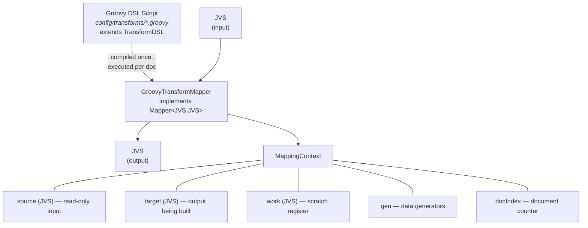
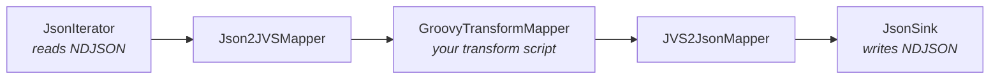
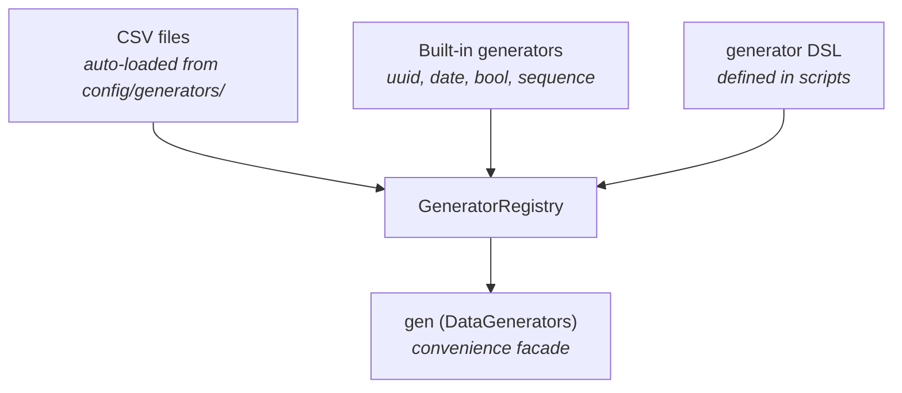

# HiTorro Data Mapper

A Groovy DSL-based data transformation framework built on JVS. Transform, enrich, and generate JSON documents using declarative scripts that can be modified at runtime without recompilation.

## Architecture



### How it works

1. A Groovy script is compiled once into a `TransformDSL` subclass
2. For each input document, a `MappingContext` is created with three JVS registers
3. The `target` starts as a deep copy of `source` (so `copyAll()` is implicit structure)
4. The script runs, reading from `source` and writing to `target` using DSL operations
5. The `target` JVS is returned as the output

### Integration with HiTorro pipelines

`GroovyTransformMapper` implements `Mapper<JVS, JVS>`, so it plugs directly into the standard iterator infrastructure:



Use `MappingIterator` to apply the mapper, `NestingIterator` to cycle through inputs, and `SkipNTakeN` to control volume.

## Running

### From Java

```java
// Load a transform script
GroovyTransformMapper mapper = GroovyTransformMapper.fromFile(
    new File("config/transforms/enrich_person.groovy"),
    new File("config/generators")
);

// Apply to a single document
JVS input = JVS.read("{\"name\":\"template\"}");
JVS output = mapper.apply(input);

// Apply to a stream of documents
Iterator<JVS> source = new MappingIterator<>(jsonIter, Json2JVSMapper.me);
Iterator<JVS> transformed = new MappingIterator<>(source, mapper);
while (transformed.hasNext()) {
    JVS doc = transformed.next();
    // write to sink, index, etc.
}
```

### Generating N documents from M templates

To produce 1000 documents from 100 input templates, cycle through the inputs:

```java
// Read 100 source docs
List<JVS> templates = loadFromNdjson("templates.ndjson");

// Create a cycling iterator that wraps around
Iterator<JVS> cycling = new CyclingDocIterator(templates, 1000);

// Apply transform to each — each gets unique generated data
GroovyTransformMapper mapper = GroovyTransformMapper.fromFile(
    new File("config/transforms/enrich_person.groovy"),
    new File("config/generators"));

Iterator<JVS> output = new MappingIterator<>(cycling, mapper);
// output produces 1000 uniquely enriched documents
```

### Inline script (no file needed)

```java
GroovyTransformMapper mapper = GroovyTransformMapper.fromString("""
    copyAll()
    set "target.id.did", gen.uuid()
    set "target.author", gen.fullName()
    mls "target.title", text: gen.product(), lang: "en"
    """, new DataGenerators(new File("config/generators")));
```

## DSL Reference

### Registers

Every script has access to three registers, all of which are JVS objects:

| Register | Access | Purpose |
|----------|--------|---------|
| `source` | read | The input document. Available as a JVS object and via `source("path")` / `sourceString("path")` helpers |
| `target` | read/write | The output document. Starts as a deep copy of source. All `set`, `copy`, `mls`, `delete`, `append` operations write here by default |
| `work` | read/write | Scratch space for intermediate computations. Prefix paths with `"work."` |

Path prefixes (`"source."`, `"target."`, `"work."`) route to the right register. Without a prefix, reads go to source, writes go to target.

### Core operations

#### `copyAll()`

Deep-copies every field from source to target. Since target starts as a copy of source, this is usually the first line — preserving the original structure before making modifications.

```groovy
copyAll()
```

#### `copy "from" to "to"`

Copies a single value (deep copy) from one path to another. Paths can be cross-register.

```groovy
copy "source.name" to "target.title"
copy "source.id.domain" to "work.original_domain"
```

#### `set path, value`

Sets a value at the given path. Creates intermediate structure as needed. Handles Groovy string interpolation (`"${variable}"`) automatically.

```groovy
set "target.status", "published"
set "target.id.did", gen.uuid()
set "target.count", 42
set "target.active", true
set "target.full_name", "${first} ${last}"     // GString → String automatic
set "target.nested.deep.path", "creates parents"
```

#### `delete path`

Removes a field from the target.

```groovy
delete "target.internal_notes"
delete "target.body.mls[0].clean"              // remove computed field
```

#### `mls path, text: "...", lang: "..."`

Creates a complete MLS (Multi-Language String) structure at the given path. The result is `{"mls": [{"text": "...", "lang": "..."}]}`.

```groovy
mls "target.title", text: "Hello World", lang: "en"
mls "target.body", text: gen.lorem(), lang: "en"
mls "target.description", text: "${productName} by ${company}", lang: "en"
```

#### `mlsAppend path, text: "...", lang: "..."`

Appends a language variant to an existing MLS array.

```groovy
mls "target.title", text: "Hello", lang: "en"
mlsAppend "target.title", text: "Bonjour", lang: "fr"
mlsAppend "target.title", text: "Hallo", lang: "de"
// Result: title.mls = [{text:"Hello",lang:"en"}, {text:"Bonjour",lang:"fr"}, {text:"Hallo",lang:"de"}]
```

#### `append path, value`

Appends a value to an array at the given path. Creates the array if it doesn't exist.

```groovy
append "target.tags", "new-tag"
append "target.scores", 95
```

### Control flow

#### `when(condition) { ... }`

Conditional execution. The body runs only if the condition is true. Use `source()` or `sourceString()` to read values for conditions.

```groovy
when(sourceString("type") == "article") {
    set "target.category", "content"
    copy "source.author" to "target.writer"
}

when(source("premium") != null && source("premium").asBoolean()) {
    set "target.tier", "premium"
}
```

#### `loop(arrayPath) { element -> ... }`

Iterates over elements of a source array. The closure receives each element as a `JsonNode`.

```groovy
loop("source.tags") { tag ->
    append "target.processed_tags", tag.asText().toUpperCase()
}

loop("source.items[]") { item ->         // trailing [] is optional
    when(item.has("active") && item.get("active").asBoolean()) {
        append "target.active_items", item
    }
}
```

#### `times(n) { index -> ... }`

Repeats a block N times. The closure receives the 0-based index.

```groovy
times(5) { i ->
    append "target.items", "item_${i}"
}

times(gen.intBetween(2, 5)) { i ->       // random number of iterations
    append "target.skills", gen.pick("Java", "Python", "Go")
}
```

### Reading source values

| Method | Returns | Example |
|--------|---------|---------|
| `source("path")` | `JsonNode` (or null) | `source("id.did")` |
| `sourceString("path")` | `String` (or null) | `sourceString("title.mls[0].text")` |
| `target("path")` | `JsonNode` | `target("computed_field")` |
| `getSource()` | `JVS` | Full source JVS object |
| `getTarget()` | `JVS` | Full target JVS object |
| `getWork()` | `JVS` | Full work register |
| `docIndex` | `int` | 0-based document counter |

### Other properties

| Property | Type | Description |
|----------|------|-------------|
| `gen` | `DataGenerators` | The data generators instance (see below) |
| `docIndex` | `int` | Increments with each document processed by the mapper |

### Custom functions

Since DSL scripts are full Groovy, you can define closures and use them as functions:

```groovy
// Define reusable functions at the top of your script
def slugify = { String text ->
    text.toLowerCase()
        .replaceAll(/[^a-z0-9\s-]/, '')
        .replaceAll(/\s+/, '-')
}

def formatPrice = { Number amount, String currency ->
    def symbol = [USD: '$', EUR: '€', GBP: '£'].getOrDefault(currency, currency)
    "${symbol}${String.format('%.2f', amount)}"
}

def excerpt = { String text, int maxLen ->
    if (text == null || text.length() <= maxLen) return text
    text.substring(0, text.lastIndexOf(' ', maxLen)) + "..."
}

// Use them in the transform
set "target.slug", slugify(gen.fullName())
set "target.price_display", formatPrice(99.95, "USD")
set "target.summary", excerpt(gen.lorem(), 120)
```

Any Groovy code works — collection methods, regex, string manipulation, math, conditional expressions, `collect`, `findAll`, etc.

## Generators

Generators are named objects that produce values on each call to `next()`. They are configurable from the DSL, backed by CSV files, or built-in.

### Architecture



On startup, the `GeneratorRegistry` auto-loads every CSV file from `config/generators/` as a cycling generator named after the file (e.g., `first_names.csv` becomes generator `"first_names"`). It also registers built-in generators for uuid, date, timestamp, bool, and sequence.

Scripts can define additional generators or override defaults.

### Defining generators in the DSL

```groovy
// Random numbers
generator "age", type: "int", min: 18, max: 65
generator "price", type: "double", min: 4.99, max: 1299.99
generator "big_id", type: "long", min: 1000000, max: 9999999

// Random boolean
generator "active", type: "bool"

// Random choice (each call picks randomly)
generator "status", type: "pick", values: ["active", "inactive", "pending"]

// Cycling list (wraps around in order: red, green, blue, red, ...)
generator "color", type: "items", values: ["red", "green", "blue"]

// Pattern-based (# = digit, ? = letter, * = alphanumeric)
generator "sku", type: "pattern", pattern: "SKU-####-??"
generator "phone", type: "pattern", pattern: "(###) ###-####"

// Sequences (increment on each call)
generator "order_num", type: "sequence", start: 1000
generator "ticket", type: "sequence", prefix: "TKT-"

// Dates
generator "dob", type: "date", from: "1960-01-01", to: "2005-12-31"
generator "any_date", type: "date"                    // last 5 years

// UUID, timestamp, constant
generator "txn_id", type: "uuid"
generator "ts", type: "timestamp"
generator "api_version", type: "constant", value: "3.0.1"

// Template — substitutes {name} with values from other generators
generator "byline", type: "template", template: "{first_names} {last_names}, {company_names}"

// CSV file
generator "custom_data", file: "my_data.csv"

// Force-override an auto-loaded default
generator "first_names", type: "items", values: ["Alice", "Bob"], force: true
```

### Accessing generator values

```groovy
gen.next("age")              // returns native type: Integer, Double, Boolean, String
gen.nextString("age")        // always returns String
gen.get("age")               // returns the Generator object

// Convenience shortcuts (backed by named generators from CSV)
gen.firstName()   gen.lastName()   gen.fullName()   gen.email()
gen.phone()       gen.city()       gen.street()     gen.address()
gen.product()     gen.company()    gen.lorem()

// Built-in shortcuts
gen.uuid()        gen.date()       gen.bool()       gen.seq()
gen.intBetween(min, max)           gen.doubleBetween(min, max)
gen.pick("a", "b", "c")           gen.dateInRange("2024-01-01", "2026-12-31")
```

### Generator type reference

| Type | Parameters | Output | Example |
|------|-----------|--------|---------|
| `int` | `min`, `max` | `Integer` | `42` |
| `long` | `min`, `max` | `Long` | `1000000L` |
| `double` | `min`, `max` | `Double` | `99.95` |
| `bool` | — | `Boolean` | `true` |
| `pick` | `values` (list) | `String` | `"active"` |
| `items` | `values` (list) | `String` (cycles) | `"red"` → `"green"` → `"blue"` → `"red"` |
| `pattern` | `pattern` | `String` | `"SKU-1234-AB"` |
| `sequence` | `start` or `prefix` | `Integer` or `String` | `1000`, `"TKT-1"` |
| `date` | `from`, `to` (optional) | `String` (ISO) | `"2024-06-15T..."` |
| `uuid` | — | `String` | `"a1b2c3d4-..."` |
| `timestamp` | — | `Long` (millis) | `1712019600000` |
| `constant` | `value` | any | `"3.0.1"` |
| `template` | `template` | `String` | `"Dear Alice Smith, Acme Corp"` |
| CSV file | `file` | `String` (cycles) | next row from CSV |

### Auto-loaded CSV generators

Any `.csv` file in `config/generators/` is automatically registered. The bundled defaults:

| Generator name | File | Count | Content |
|---------------|------|-------|---------|
| `first_names` | `first_names.csv` | 100 | Diverse first names |
| `last_names` | `last_names.csv` | 100 | Diverse surnames |
| `cities` | `cities.csv` | 80 | Worldwide cities |
| `streets` | `streets.csv` | 80 | Street addresses |
| `phone_numbers` | `phone_numbers.csv` | 80 | Various formats |
| `product_names` | `product_names.csv` | 80 | Product names |
| `company_names` | `company_names.csv` | 60 | Fictional companies |
| `email_domains` | `email_domains.csv` | 30 | Email domains |
| `lorem` | `lorem.csv` | 30 | Lorem paragraphs |

To add your own, drop a CSV file (header row + data rows, first column used) into `config/generators/`.

## Annotated Script Examples

### Example 1: Person enrichment (`enrich_person.groovy`)

Takes any document as a template and enriches it into a fully populated person record. Demonstrates: DSL-defined generators, custom functions, MLS, variable-length arrays.

```groovy
// --- Define generators specific to this transform ---
generator "age", type: "int", min: 18, max: 75
generator "salary", type: "double", min: 35000.0, max: 250000.0
generator "emp_id", type: "sequence", prefix: "EMP-"
generator "dept", type: "pick", values: ["Engineering", "Product", "Sales",
        "Marketing", "Operations", "Finance", "HR"]
generator "seniority", type: "pick", values: ["Junior", "Mid-Level", "Senior",
        "Staff", "Principal"]
generator "dob", type: "date", from: "1955-01-01", to: "2005-12-31"

// --- Custom functions (plain Groovy closures) ---
// Since scripts are full Groovy, you can define any function you need.

def formatPhone = { String raw ->
    def digits = raw.replaceAll(/[^0-9]/, '')
    if (digits.length() >= 10) {
        digits = digits[-10..-1]
        return "(${digits[0..2]}) ${digits[3..5]}-${digits[6..9]}"
    }
    return raw
}

def slugify = { String text ->
    text.toLowerCase()
        .replaceAll(/[^a-z0-9\s-]/, '')
        .replaceAll(/\s+/, '-')
}

def titleCase = { String text ->
    text.split(/\s+/).collect { it.capitalize() }.join(' ')
}

// --- Transform ---
copyAll()

set "target.type", "person"
set "target.id.domain", "synthetic"
set "target.id.did", gen.uuid()

def first = gen.firstName()
def last = gen.lastName()
def fullName = titleCase("${first} ${last}")

set "target.first_name", first
set "target.last_name", last
set "target.full_name", fullName
set "target.slug", slugify(fullName)     // custom function: "elena-nakamura"

set "target.email", gen.email()
set "target.phone", formatPhone(gen.phone())   // custom function: "(555) 234-5678"
set "target.birth_date", gen.next("dob")       // DSL-defined generator

// Employment — all from DSL-defined generators
set "target.employee_id", gen.next("emp_id")   // "EMP-1", "EMP-2", ...
set "target.department", gen.next("dept")
set "target.seniority", gen.next("seniority")
set "target.salary", gen.next("salary")        // native Double, not String

mls "target.title", text: fullName, lang: "en"
mls "target.body", text: gen.lorem(), lang: "en"

times(gen.intBetween(2, 6)) { i ->
    append "target.skills", gen.pick("Java", "Python", "Go", "Rust", "TypeScript",
            "SQL", "Kubernetes", "Machine Learning", "NLP", "Data Engineering")
}

set "target.address", gen.address()
set "target.company", gen.company()
set "target.times.created", gen.date()
set "target.times.modified", gen.date()
```

**Key patterns**: `generator` DSL for typed data, custom closures for formatting/slugifying, `gen.next("name")` preserves native types, sequence generators for IDs.

### Example 2: Article transform (`article_transform.groovy`)

Transforms any document into an article. Demonstrates: template generators, custom functions, conditionals, loops.

```groovy
// --- Generators ---
generator "word_count", type: "int", min: 200, max: 5000
generator "read_time", type: "int", min: 1, max: 20
generator "article_seq", type: "sequence", prefix: "ART-"
generator "rating", type: "double", min: 1.0, max: 5.0
generator "pub", type: "pick", values: ["Tech Daily", "Innovation Weekly",
        "The Data Journal", "AI Review", "Open Source Times"]
// Template generator — substitutes {name} with values from other named generators
generator "byline", type: "template", template: "{first_names} {last_names}, {company_names}"

// --- Custom functions ---
def excerpt = { String text, int maxLen ->
    if (text == null || text.length() <= maxLen) return text
    def cut = text.lastIndexOf(' ', maxLen)
    if (cut < 0) cut = maxLen
    text.substring(0, cut) + "..."
}

def hashTags = { String... words ->
    words.collect { "#${it.toLowerCase().replaceAll(/\s+/, '')}" }
}

// --- Transform ---
copyAll()

set "target.type", "article"
set "target.id.domain", "articles"
set "target.id.did", gen.uuid()
set "target.article_id", gen.next("article_seq")

// Byline from template generator: "Alice Smith, Acme Corp"
set "target.author", gen.next("byline")
set "target.publication", gen.next("pub")

// Conditional: preserve source title or generate one
def sourceTitle = sourceString("title.mls[0].text")
when(sourceTitle != null) {
    mls "target.title", text: sourceTitle, lang: "en"
}
when(sourceTitle == null) {
    mls "target.title", text: "Article: ${gen.product()}", lang: "en"
}

// Body with computed excerpt using custom function
def bodyText = gen.lorem()
mls "target.body", text: bodyText, lang: "en"
set "target.excerpt", excerpt(bodyText, 120)

// Numeric metadata from generators
set "target.word_count", gen.next("word_count")     // Integer
set "target.read_time_minutes", gen.next("read_time")
set "target.rating", gen.next("rating")              // Double

// Tags: source tags + generated hash tags using custom function
loop("source.tags[]") { tag -> append "target.tags", tag }
hashTags("trending", gen.product(), gen.company()).each { tag ->
    append "target.tags", tag
}
```

**Key patterns**: template generator composing other generators, custom functions for text processing, `gen.next()` preserving numeric types, Groovy collection methods (`collect`, `each`).

### Example 3: Product catalog (`product_catalog.groovy`)

Generates product entries with category-specific fields. Demonstrates: pattern generators, custom functions for formatting, conditional polymorphism.

```groovy
// --- Generators ---
generator "sku", type: "pattern", pattern: "SKU-####-??"   // "SKU-1234-AB"
generator "price", type: "double", min: 4.99, max: 1299.99
generator "stock", type: "int", min: 0, max: 500
generator "weight", type: "double", min: 0.05, max: 25.0
generator "rating", type: "double", min: 1.0, max: 5.0
generator "review_count", type: "int", min: 0, max: 2500
generator "discount_pct", type: "pick", values: ["0", "5", "10", "15", "20", "25", "30"]
generator "sw_version", type: "pattern", pattern: "#.#.##"  // "3.1.42"

// --- Custom functions ---
def formatPrice = { Number amount, String currency ->
    def symbol = [USD: '$', EUR: '\u20ac', GBP: '\u00a3'].getOrDefault(currency, currency)
    "${symbol}${String.format('%.2f', amount)}"
}

def inStock = { int qty -> qty > 0 ? "In Stock (${qty})" : "Out of Stock" }

def generateBarcode = { ->
    (1..13).collect { gen.intBetween(0, 9) }.join('')   // EAN-13 style
}

// --- Transform ---
copyAll()

set "target.sku", gen.next("sku")
set "target.barcode", generateBarcode()

def price = gen.next("price") as double
def currency = gen.pick("USD", "EUR", "GBP")
def stockQty = gen.next("stock") as int

set "target.price", price
set "target.price_formatted", formatPrice(price, currency)  // "$149.95"
set "target.stock_quantity", stockQty
set "target.availability", inStock(stockQty)   // "In Stock (42)" or "Out of Stock"
set "target.rating", gen.next("rating")

// Category-specific conditional fields
def category = gen.pick("Electronics", "Software", "Food & Beverage")
when(category == "Electronics") {
    set "target.weight_kg", gen.next("weight")
}
when(category == "Software") {
    set "target.version", gen.next("sw_version")   // pattern: "3.1.42"
}

// Computed discount
def discount = gen.next("discount_pct") as int
when(discount > 0) {
    set "target.sale_price", price * (1 - discount / 100.0)
    set "target.sale_price_formatted", formatPrice(price * (1 - discount / 100.0), currency)
}
```

**Key patterns**: pattern generators for SKUs/versions, custom functions for formatting and display, conditional polymorphism, `as double` / `as int` for type casting in Groovy.

## Use Cases

### 1. Schema migration

Transform documents from an old schema to a new one:

```groovy
// Flatten nested author object into a single string
def authorFirst = sourceString("author.first_name")
def authorLast = sourceString("author.last_name")
when(authorFirst != null) {
    set "target.author", "${authorFirst} ${authorLast}"
    delete "target.author.first_name"
    delete "target.author.last_name"
}

// Rename field
copy "source.pub_date" to "target.published_date"
delete "target.pub_date"

// Add new required field with default
when(source("classification") == null) {
    set "target.classification", "unclassified"
}
```

### 2. Test data generation

Generate 10,000 test documents from a handful of templates:

```java
List<JVS> templates = loadNdjson("seed_docs.ndjson");        // 50 templates
Iterator<JVS> cycling = new CyclingDocIterator(templates, 10000);
GroovyTransformMapper mapper = GroovyTransformMapper.fromFile(
    new File("config/transforms/enrich_person.groovy"),
    new File("config/generators"));
Iterator<JVS> output = new MappingIterator<>(cycling, mapper);
// Each of 10,000 docs gets unique names, emails, dates, skills
```

### 3. Data anonymization

Replace PII with generated equivalents:

```groovy
copyAll()
set "target.first_name", gen.firstName()
set "target.last_name", gen.lastName()
set "target.email", gen.email()
set "target.phone", gen.phone()
set "target.address", gen.address()
set "target.ssn", null                // remove sensitive field entirely
delete "target.credit_card"
```

### 4. Document enrichment pipeline

Add computed fields before indexing:

```groovy
copyAll()

// Generate search-friendly slug from title
def title = sourceString("title.mls[0].text")
when(title != null) {
    def slug = title.toLowerCase().replaceAll("[^a-z0-9]+", "-")
    set "target.slug", slug
}

// Add word count
def body = sourceString("body.mls[0].text")
when(body != null) {
    set "target.word_count", body.split("\\s+").length
}

// Tag by content length
when(body != null && body.length() > 5000) {
    append "target.tags", "long-form"
}
when(body != null && body.length() < 500) {
    append "target.tags", "brief"
}
```

### 5. Multi-language document creation

```groovy
copyAll()

def title = gen.product()
mls "target.title", text: title, lang: "en"
mlsAppend "target.title", text: "Produkt: ${title}", lang: "de"
mlsAppend "target.title", text: "Produit: ${title}", lang: "fr"

mls "target.description", text: gen.lorem(), lang: "en"
mlsAppend "target.description", text: gen.lorem(), lang: "de"
```

## Extending the DSL

### Adding new generator types

Drop a CSV file into `config/generators/` and access it immediately:

```
config/generators/colors.csv:
color
Red
Blue
Green
...
```

```groovy
set "target.color", gen.list("colors").next()
```

### Adding new DSL operations

Extend `TransformDSL` with a new method:

```java
public class MyTransformDSL extends TransformDSL {
    public void setIdFrom(String... fields) {
        StringBuilder sb = new StringBuilder();
        for (String f : fields) {
            String val = sourceString(f);
            if (val != null) {
                if (sb.length() > 0) sb.append("_");
                sb.append(val);
            }
        }
        set("target.id.did", sb.toString());
    }
}
```

Then configure the compiler to use your base class:

```java
CompilerConfiguration config = new CompilerConfiguration();
config.setScriptBaseClass(MyTransformDSL.class.getName());
```

## File Locations

| Path | Content |
|------|---------|
| `hitorro-util/config/transforms/` | Source of truth for Groovy scripts |
| `hitorro-util/config/generators/` | Source of truth for CSV data files |
| `config/transforms/` | Runtime copy (synced at build time) |
| `config/generators/` | Runtime copy (synced at build time) |

Scripts and CSVs are synced to the runtime config by `maven-resources-plugin` during `mvn compile`.
