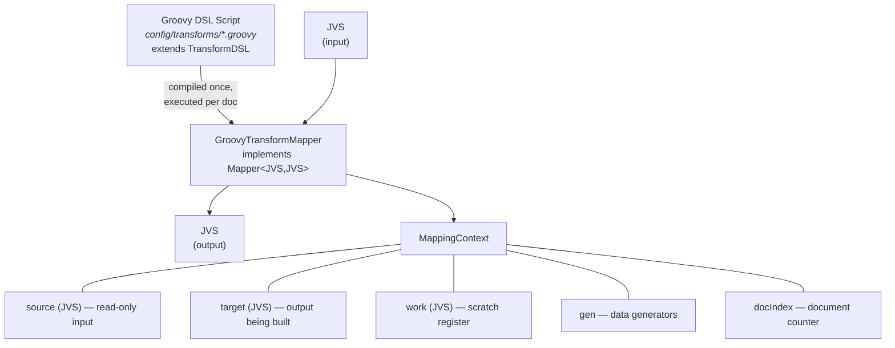
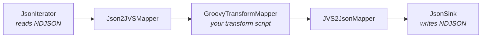

# HiTorro Data Mapper

A Groovy DSL-based data transformation framework built on JVS. Transform, enrich, and generate JSON documents using declarative scripts that can be modified at runtime without recompilation.

## Architecture



### How it works

1. A Groovy script is compiled once into a `TransformDSL` subclass
2. For each input document, a `MappingContext` is created with three JVS registers
3. The `target` starts as a deep copy of `source` (so `copyAll()` is implicit structure)
4. The script runs, reading from `source` and writing to `target` using DSL operations
5. The `target` JVS is returned as the output

### Integration with HiTorro pipelines

`GroovyTransformMapper` implements `Mapper<JVS, JVS>`, so it plugs directly into the standard iterator infrastructure:



Use `MappingIterator` to apply the mapper, `NestingIterator` to cycle through inputs, and `SkipNTakeN` to control volume.

## Running

### From Java

```java
// Load a transform script
GroovyTransformMapper mapper = GroovyTransformMapper.fromFile(
    new File("config/transforms/enrich_person.groovy"),
    new File("config/generators")
);

// Apply to a single document
JVS input = JVS.read("{\"name\":\"template\"}");
JVS output = mapper.apply(input);

// Apply to a stream of documents
Iterator<JVS> source = new MappingIterator<>(jsonIter, Json2JVSMapper.me);
Iterator<JVS> transformed = new MappingIterator<>(source, mapper);
while (transformed.hasNext()) {
    JVS doc = transformed.next();
    // write to sink, index, etc.
}
```

### Generating N documents from M templates

To produce 1000 documents from 100 input templates, cycle through the inputs:

```java
// Read 100 source docs
List<JVS> templates = loadFromNdjson("templates.ndjson");

// Create a cycling iterator that wraps around
Iterator<JVS> cycling = new CyclingDocIterator(templates, 1000);

// Apply transform to each — each gets unique generated data
GroovyTransformMapper mapper = GroovyTransformMapper.fromFile(
    new File("config/transforms/enrich_person.groovy"),
    new File("config/generators"));

Iterator<JVS> output = new MappingIterator<>(cycling, mapper);
// output produces 1000 uniquely enriched documents
```

### Inline script (no file needed)

```java
GroovyTransformMapper mapper = GroovyTransformMapper.fromString("""
    copyAll()
    set "target.id.did", gen.uuid()
    set "target.author", gen.fullName()
    mls "target.title", text: gen.product(), lang: "en"
    """, new DataGenerators(new File("config/generators")));
```

## DSL Reference

### Registers

Every script has access to three registers, all of which are JVS objects:

| Register | Access | Purpose |
|----------|--------|---------|
| `source` | read | The input document. Available as a JVS object and via `source("path")` / `sourceString("path")` helpers |
| `target` | read/write | The output document. Starts as a deep copy of source. All `set`, `copy`, `mls`, `delete`, `append` operations write here by default |
| `work` | read/write | Scratch space for intermediate computations. Prefix paths with `"work."` |

Path prefixes (`"source."`, `"target."`, `"work."`) route to the right register. Without a prefix, reads go to source, writes go to target.

### Core operations

#### `copyAll()`

Deep-copies every field from source to target. Since target starts as a copy of source, this is usually the first line — preserving the original structure before making modifications.

```groovy
copyAll()
```

#### `copy "from" to "to"`

Copies a single value (deep copy) from one path to another. Paths can be cross-register.

```groovy
copy "source.name" to "target.title"
copy "source.id.domain" to "work.original_domain"
```

#### `set path, value`

Sets a value at the given path. Creates intermediate structure as needed. Handles Groovy string interpolation (`"${variable}"`) automatically.

```groovy
set "target.status", "published"
set "target.id.did", gen.uuid()
set "target.count", 42
set "target.active", true
set "target.full_name", "${first} ${last}"     // GString → String automatic
set "target.nested.deep.path", "creates parents"
```

#### `delete path`

Removes a field from the target.

```groovy
delete "target.internal_notes"
delete "target.body.mls[0].clean"              // remove computed field
```

#### `mls path, text: "...", lang: "..."`

Creates a complete MLS (Multi-Language String) structure at the given path. The result is `{"mls": [{"text": "...", "lang": "..."}]}`.

```groovy
mls "target.title", text: "Hello World", lang: "en"
mls "target.body", text: gen.lorem(), lang: "en"
mls "target.description", text: "${productName} by ${company}", lang: "en"
```

#### `mlsAppend path, text: "...", lang: "..."`

Appends a language variant to an existing MLS array.

```groovy
mls "target.title", text: "Hello", lang: "en"
mlsAppend "target.title", text: "Bonjour", lang: "fr"
mlsAppend "target.title", text: "Hallo", lang: "de"
// Result: title.mls = [{text:"Hello",lang:"en"}, {text:"Bonjour",lang:"fr"}, {text:"Hallo",lang:"de"}]
```

#### `append path, value`

Appends a value to an array at the given path. Creates the array if it doesn't exist.

```groovy
append "target.tags", "new-tag"
append "target.scores", 95
```

### Control flow

#### `when(condition) { ... }`

Conditional execution. The body runs only if the condition is true. Use `source()` or `sourceString()` to read values for conditions.

```groovy
when(sourceString("type") == "article") {
    set "target.category", "content"
    copy "source.author" to "target.writer"
}

when(source("premium") != null && source("premium").asBoolean()) {
    set "target.tier", "premium"
}
```

#### `loop(arrayPath) { element -> ... }`

Iterates over elements of a source array. The closure receives each element as a `JsonNode`.

```groovy
loop("source.tags") { tag ->
    append "target.processed_tags", tag.asText().toUpperCase()
}

loop("source.items[]") { item ->         // trailing [] is optional
    when(item.has("active") && item.get("active").asBoolean()) {
        append "target.active_items", item
    }
}
```

#### `times(n) { index -> ... }`

Repeats a block N times. The closure receives the 0-based index.

```groovy
times(5) { i ->
    append "target.items", "item_${i}"
}

times(gen.intBetween(2, 5)) { i ->       // random number of iterations
    append "target.skills", gen.pick("Java", "Python", "Go")
}
```

### Reading source values

| Method | Returns | Example |
|--------|---------|---------|
| `source("path")` | `JsonNode` (or null) | `source("id.did")` |
| `sourceString("path")` | `String` (or null) | `sourceString("title.mls[0].text")` |
| `target("path")` | `JsonNode` | `target("computed_field")` |
| `getSource()` | `JVS` | Full source JVS object |
| `getTarget()` | `JVS` | Full target JVS object |
| `getWork()` | `JVS` | Full work register |
| `docIndex` | `int` | 0-based document counter |

### Other properties

| Property | Type | Description |
|----------|------|-------------|
| `gen` | `DataGenerators` | The data generators instance (see below) |
| `docIndex` | `int` | Increments with each document processed by the mapper |

## Data Generators

Available in scripts as `gen`. Generators draw from CSV files in `config/generators/` and cycle back to the beginning when exhausted.

### Person data

| Method | Example output | Source |
|--------|---------------|--------|
| `gen.firstName()` | `"Elena"` | `first_names.csv` (100 names) |
| `gen.lastName()` | `"Nakamura"` | `last_names.csv` (100 names) |
| `gen.fullName()` | `"Elena Nakamura"` | combines first + last |
| `gen.email()` | `"elena.nakamura@techmail.io"` | combines name + `email_domains.csv` |

### Contact & location

| Method | Example output | Source |
|--------|---------------|--------|
| `gen.phone()` | `"+1-555-234-5678"` | `phone_numbers.csv` (80 numbers) |
| `gen.city()` | `"Portland"` | `cities.csv` (80 cities) |
| `gen.street()` | `"742 Evergreen Terrace"` | `streets.csv` (80 streets) |
| `gen.address()` | `"742 Evergreen Terrace, Portland"` | combines street + city |

### Business data

| Method | Example output | Source |
|--------|---------------|--------|
| `gen.product()` | `"CloudSync Pro"` | `product_names.csv` (80 products) |
| `gen.company()` | `"Nexus Dynamics"` | `company_names.csv` (60 companies) |

### Text

| Method | Example output | Source |
|--------|---------------|--------|
| `gen.lorem()` | `"Lorem ipsum dolor sit amet..."` | `lorem.csv` (30 paragraphs) |

### Built-in generators (no CSV)

| Method | Description |
|--------|-------------|
| `gen.uuid()` | Random UUID string |
| `gen.date()` | Random ISO date within last 5 years |
| `gen.dateInRange("2024-01-01", "2026-12-31")` | Random date in range |
| `gen.intBetween(1, 100)` | Random integer (inclusive) |
| `gen.longBetween(1L, 1000000L)` | Random long |
| `gen.doubleBetween(0.0, 999.99)` | Random double |
| `gen.bool()` | Random boolean |
| `gen.pick("a", "b", "c")` | Random choice from options |

### Custom CSV lists

Add any CSV file to `config/generators/` and access it from a script:

```groovy
def colors = gen.list("colors")       // loads colors.csv
set "target.color", colors.next()     // cycles through values
```

CSV format: first row is a header (skipped), first column is the value.

## Annotated Script Examples

### Example 1: Person enrichment (`enrich_person.groovy`)

Takes any document as a template and enriches it into a fully populated person record.

```groovy
// Start by preserving the original document structure.
// target is already a deep copy of source, but copyAll() makes intent explicit.
copyAll()

// Override the type system identity — this becomes a "person" document
// with a new unique ID in the "synthetic" domain.
set "target.type", "person"
set "target.id.domain", "synthetic"
set "target.id.did", gen.uuid()

// Generate a person's name. We store in local variables because we need
// the same first/last name in multiple places (fields + MLS title).
def first = gen.firstName()    // draws from first_names.csv, cycling
def last = gen.lastName()

set "target.first_name", first
set "target.last_name", last
set "target.full_name", "${first} ${last}"    // Groovy string interpolation

// Contact info — each generator call advances its cycling list independently,
// so every document gets a different combination.
set "target.email", gen.email()
set "target.phone", gen.phone()
set "target.birth_date", gen.dateInRange("1960-01-01", "2005-12-31")

// Create MLS (Multi-Language String) structures for title and body.
// These produce the {"mls": [{"text": "...", "lang": "en"}]} format
// that the HiTorro type system expects.
mls "target.title", text: "${first} ${last}", lang: "en"
mls "target.body", text: gen.lorem(), lang: "en"

// Variable-length array: each person gets 2-5 random skills.
// times() with a random count + gen.pick() for each value.
times(gen.intBetween(2, 5)) { i ->
    append "target.skills", gen.pick("Java", "Python", "Go", "Rust", "TypeScript",
            "SQL", "Kubernetes", "Machine Learning", "NLP", "Data Engineering")
}

set "target.address", gen.address()
set "target.company", gen.company()
set "target.times.created", gen.date()
set "target.times.modified", gen.date()
```

**Key patterns**: local variables for reuse, MLS creation, variable-length arrays via `times` + `intBetween`, string interpolation.

### Example 2: Article transform (`article_transform.groovy`)

Transforms any document into an article, preserving source data where appropriate and generating the rest.

```groovy
copyAll()

set "target.type", "article"
set "target.id.domain", "articles"
set "target.id.did", gen.uuid()

set "target.author", gen.fullName()
set "target.publication", gen.pick("Tech Daily", "Innovation Weekly",
        "The Data Journal", "AI Review", "Open Source Times")

// Conditional logic: check if the source has a title.
// sourceString() reads from the source JVS — returns null if the path doesn't exist.
def sourceTitle = sourceString("title.mls[0].text")
when(sourceTitle != null) {
    // Source has a title — preserve it
    mls "target.title", text: sourceTitle, lang: "en"
}
when(sourceTitle == null) {
    // No title — generate one from product name + lorem snippet
    mls "target.title", text: "Article: ${gen.product()} — ${gen.lorem().substring(0, 40)}", lang: "en"
}

mls "target.body", text: gen.lorem(), lang: "en"

set "target.published_date", gen.dateInRange("2024-01-01", "2026-03-31")
set "target.times.created", gen.date()
set "target.times.modified", gen.date()

// Generate 1-3 categories
times(gen.intBetween(1, 3)) {
    append "target.category", gen.pick("Technology", "Science", "Business",
            "Health", "Education", "Engineering")
}

// Carry over source tags if they exist, then add generated ones.
// loop() iterates the source array — each element is a JsonNode.
loop("source.tags[]") { tag ->
    append "target.tags", tag
}
times(gen.intBetween(1, 3)) {
    append "target.tags", gen.pick("trending", "featured", "review",
            "tutorial", "analysis", "opinion")
}

set "target.source_url", "https://example.com/articles/${gen.uuid()}"
```

**Key patterns**: conditional source-data preservation, loop over source arrays, mixing source data with generated data, `sourceString()` for null-safe reads.

### Example 3: Product catalog (`product_catalog.groovy`)

Generates product entries with category-specific fields using conditional branching.

```groovy
copyAll()

set "target.type", "product"
set "target.id.domain", "products"
set "target.id.did", gen.uuid()

// Generate core product data into local variables.
// Using variables lets us reference the same values in multiple places
// and use them in conditional logic below.
def productName = gen.product()
def company = gen.company()
def price = gen.doubleBetween(9.99, 999.99)
def category = gen.pick("Electronics", "Home & Garden", "Software",
        "Office Supplies", "Food & Beverage", "Health & Wellness")

// The work register is scratch space — useful for storing intermediate
// values that don't belong in the output but might be needed later.
set "work.price", price
set "work.category", category

mls "target.title", text: "${productName} by ${company}", lang: "en"
mls "target.description", text: gen.lorem(), lang: "en"

set "target.product_name", productName
set "target.manufacturer", company
set "target.price", price
set "target.currency", gen.pick("USD", "EUR", "GBP")

// Category-specific fields: different product types get different metadata.
// Each when() block only executes if its condition is true.
// This is how you model polymorphic output based on generated data.
when(category == "Electronics") {
    set "target.warranty_months", gen.intBetween(12, 36)
    set "target.weight_kg", gen.doubleBetween(0.1, 15.0)
}
when(category == "Software") {
    set "target.license", gen.pick("MIT", "Apache-2.0", "Commercial", "Subscription")
    set "target.version", "${gen.intBetween(1,5)}.${gen.intBetween(0,9)}.${gen.intBetween(0,99)}"
}
when(category == "Food & Beverage") {
    set "target.expiry_date", gen.dateInRange("2026-06-01", "2027-12-31")
}

// Groovy string methods work directly — normalize category for tags
append "target.tags", category.toLowerCase().replace(" & ", "-").replace(" ", "-")
append "target.tags", gen.pick("bestseller", "new-arrival", "sale", "premium", "eco-friendly")

set "target.times.created", gen.date()
set "target.times.modified", gen.date()
```

**Key patterns**: work register for intermediates, category-based conditional fields, Groovy string manipulation, numeric generators for prices/weights.

## Use Cases

### 1. Schema migration

Transform documents from an old schema to a new one:

```groovy
// Flatten nested author object into a single string
def authorFirst = sourceString("author.first_name")
def authorLast = sourceString("author.last_name")
when(authorFirst != null) {
    set "target.author", "${authorFirst} ${authorLast}"
    delete "target.author.first_name"
    delete "target.author.last_name"
}

// Rename field
copy "source.pub_date" to "target.published_date"
delete "target.pub_date"

// Add new required field with default
when(source("classification") == null) {
    set "target.classification", "unclassified"
}
```

### 2. Test data generation

Generate 10,000 test documents from a handful of templates:

```java
List<JVS> templates = loadNdjson("seed_docs.ndjson");        // 50 templates
Iterator<JVS> cycling = new CyclingDocIterator(templates, 10000);
GroovyTransformMapper mapper = GroovyTransformMapper.fromFile(
    new File("config/transforms/enrich_person.groovy"),
    new File("config/generators"));
Iterator<JVS> output = new MappingIterator<>(cycling, mapper);
// Each of 10,000 docs gets unique names, emails, dates, skills
```

### 3. Data anonymization

Replace PII with generated equivalents:

```groovy
copyAll()
set "target.first_name", gen.firstName()
set "target.last_name", gen.lastName()
set "target.email", gen.email()
set "target.phone", gen.phone()
set "target.address", gen.address()
set "target.ssn", null                // remove sensitive field entirely
delete "target.credit_card"
```

### 4. Document enrichment pipeline

Add computed fields before indexing:

```groovy
copyAll()

// Generate search-friendly slug from title
def title = sourceString("title.mls[0].text")
when(title != null) {
    def slug = title.toLowerCase().replaceAll("[^a-z0-9]+", "-")
    set "target.slug", slug
}

// Add word count
def body = sourceString("body.mls[0].text")
when(body != null) {
    set "target.word_count", body.split("\\s+").length
}

// Tag by content length
when(body != null && body.length() > 5000) {
    append "target.tags", "long-form"
}
when(body != null && body.length() < 500) {
    append "target.tags", "brief"
}
```

### 5. Multi-language document creation

```groovy
copyAll()

def title = gen.product()
mls "target.title", text: title, lang: "en"
mlsAppend "target.title", text: "Produkt: ${title}", lang: "de"
mlsAppend "target.title", text: "Produit: ${title}", lang: "fr"

mls "target.description", text: gen.lorem(), lang: "en"
mlsAppend "target.description", text: gen.lorem(), lang: "de"
```

## Extending the DSL

### Adding new generator types

Drop a CSV file into `config/generators/` and access it immediately:

```
config/generators/colors.csv:
color
Red
Blue
Green
...
```

```groovy
set "target.color", gen.list("colors").next()
```

### Adding new DSL operations

Extend `TransformDSL` with a new method:

```java
public class MyTransformDSL extends TransformDSL {
    public void setIdFrom(String... fields) {
        StringBuilder sb = new StringBuilder();
        for (String f : fields) {
            String val = sourceString(f);
            if (val != null) {
                if (sb.length() > 0) sb.append("_");
                sb.append(val);
            }
        }
        set("target.id.did", sb.toString());
    }
}
```

Then configure the compiler to use your base class:

```java
CompilerConfiguration config = new CompilerConfiguration();
config.setScriptBaseClass(MyTransformDSL.class.getName());
```

## File Locations

| Path | Content |
|------|---------|
| `hitorro-util/config/transforms/` | Source of truth for Groovy scripts |
| `hitorro-util/config/generators/` | Source of truth for CSV data files |
| `config/transforms/` | Runtime copy (synced at build time) |
| `config/generators/` | Runtime copy (synced at build time) |

Scripts and CSVs are synced to the runtime config by `maven-resources-plugin` during `mvn compile`.
