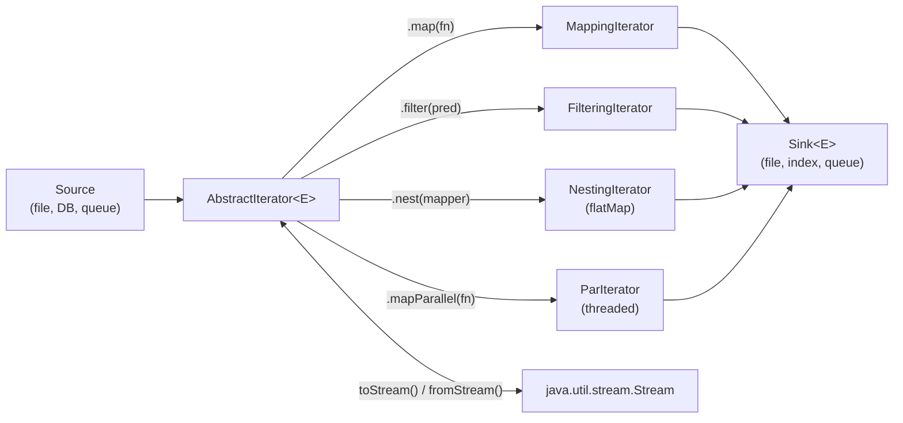

# HiTorro Iterator Infrastructure

The iterator/mapper/sink framework is the core data processing pipeline of HiTorro. It predates Java 8 Streams but has been progressively modernized to integrate with them.

## Architecture



### Core interfaces

| Interface | Extends | Purpose |
|-----------|---------|---------|
| `ChainingIteratorIntf<E>` | `CloseableIterator<E>` | Fluent chaining: `.map()`, `.filter()`, `.nest()`, `.sink()` |
| `Mapper<I, O>` | `Function<I, O>` | Transform elements — compatible with Stream `.map()` |
| `Sink<T>` | `Consumer<T>`, `AutoCloseable` | Terminal operations — `.add()`, `.start()`, `.stop()` |

### Key classes

| Class | Stream equivalent | Purpose |
|-------|-------------------|---------|
| `MappingIterator` | `.map()` | Transform each element, skip nulls |
| `FilteringIterator` | `.filter()` | Keep elements matching predicate |
| `NestingIterator` | `.flatMap()` | Expand each element into a sub-iterator |
| `SkipNTakeM` | `.skip().limit()` | Windowed processing |
| `ParIterator` | `.parallel()` | Multi-threaded processing via queues |
| `SortIterator` | `.sorted()` | In-memory sort |
| `CountingIterator` | (no equivalent) | Count elements with optional periodic reporting |

## Bug Fixes Applied

### 1. `PredicatedSink.add()` always returned `false`

**Before:** Returned `false` unconditionally, even when the predicate matched and the inner sink succeeded.

**After:** Returns the result of `this.sink.add(o)` when the predicate matches.

### 2. `Sink.accept()` silently swallowed exceptions

**Before:** The `Consumer<T>` bridge had empty catch blocks for `IOException` / `StoreException`.

**After:** Wraps in `RuntimeException` so errors propagate when sinks are used as consumers (e.g., in `forEach`).

### 3. `FilterToSinkIterator` silently swallowed sink errors

**Before:** Empty catch blocks for both `IOException` and `StoreException`.

**After:** Logs errors via `Log.util.error()` with exception message.

### 4. `ThreadedQueueIterator.completed` not volatile

**Before:** The `completed` flag was read/written from different threads without synchronization. Could miss completion signals due to CPU caching.

**After:** Marked `volatile`.

### 5. `NestingIterator.close()` didn't close inner iterator

**Before:** Only closed the outer iterator. Inner iterator (potentially holding file handles, network connections) was leaked.

**After:** Closes `currIter` before closing the outer `iter`.

### 6. `toArray()` ignored `start` parameter

**Before:** `array[count++]` always wrote starting at index 0, ignoring the `start` parameter.

**After:** `array[start + count]` writes at the correct offset.

### 7. `Spliterator` reported no characteristics

**Before:** `Spliterators.spliterator(this, 0, 0)` — zero size estimate and no characteristics.

**After:** `Spliterators.spliteratorUnknownSize(this, Spliterator.ORDERED)` — correctly reports `ORDERED` and unknown size.

## Java Streams Integration

### Bridge: HiTorro → Stream

```java
AbstractIterator<String> iter = ...; // any HiTorro iterator

// toStream() — closes the iterator when the stream closes
try (Stream<String> stream = iter.toStream()) {
    List<String> results = stream
        .filter(s -> s.length() > 3)
        .map(String::toUpperCase)
        .collect(Collectors.toList());
}

// collect() — terminal operation using standard Collectors
List<String> list = iter.collect(Collectors.toList());
String joined = iter.collect(Collectors.joining(", "));
Map<Character, List<String>> grouped = iter.collect(Collectors.groupingBy(s -> s.charAt(0)));
```

### Bridge: Stream → HiTorro

```java
Stream<String> stream = Stream.of("a", "b", "c");

// fromStream() — wraps a Stream in an AbstractIterator
AbstractIterator<String> iter = AbstractIterator.fromStream(stream);

// Now use all HiTorro chaining operations
iter.filter(s -> s.length() > 0)
    .map(String::toUpperCase)
    .sink(mySink);
```

### When to use which

| Use HiTorro iterators when | Use Java Streams when |
|----------------------------|----------------------|
| Processing files/IO with `Sink` lifecycle (start/stop) | Simple in-memory transformations |
| Need `NestingIterator` (flatMap with resource management) | Parallel collection processing |
| Pipeline includes `mapParallel()` with queues | Need `Collectors.groupingBy`, `partitioningBy` |
| Legacy code that already uses the framework | New code with no sink requirements |
| Need `SkipNTakeM` windowing | Need `reduce`, `min`, `max` |

The two systems are fully interoperable — you can start with a Stream, convert to an AbstractIterator for sink processing, and convert back to a Stream at any point.

## Tests

| Test class | Count | Coverage |
|-----------|-------|---------|
| `IteratorInfrastructureTest` | 16 | All bug fixes, toStream, fromStream, collect, spliterator, toArray |
| `MappingIteratorTest` | (existing) | MappingIterator core behavior |
| `FilteringIteratorTest` | (existing) | FilteringIterator core behavior |
